# Timelapse

A hub for time keeping & quantified-self

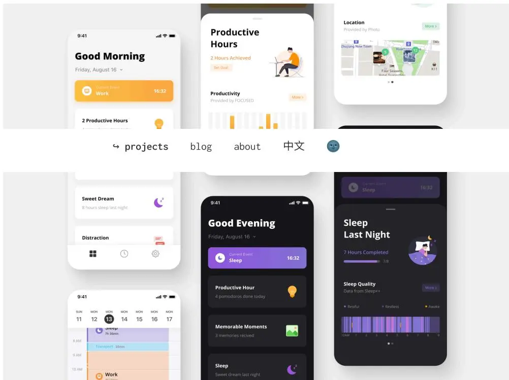

The image displays a collection of mobile app screenshots for 'Timelapse', illustrating its functionality in time management and self-tracking. The screenshots are arranged in a collage:

- Good Morning:** Shows the start of a day on Friday, August 16, with a 'Current Event: Work' at 16:32 and '2 Productive Hours' achieved.
- Productive Hours:** Displays '2 Hours Achieved' with a 'Set Goal' button and a bar chart showing productivity levels.
- Location:** A map view showing the user's location, 'Zhuziang New Town', and nearby points of interest like 'Four Seasons Hotel' and 'X11'.
- Sweet Dream:** Reports '8 hours sleep last night' with a moon icon.
- Distraction:** A section with icons for various distractions like social media and gaming.
- Good Evening:** Shows the end of the day with 'Current Event: Sleep' at 16:32, '4 pomodoros done today', and '3 memories recived'.
- Sleep Last Night:** Displays '7 Hours Completed' with a progress bar and a 'Sleep Quality' section showing data from sleep++.
- Calendar View:** A weekly calendar showing the current day (August 13) and upcoming events like 'Transport: 35min' and 'Work'.

Navigation links at the bottom include: projects, blog, about, 中文, and a user profile icon.

A collage of mobile app screenshots for 'Timelapse', showing various time-tracking and productivity features.

## Overview

“Quantified-self” means to track daily lives with proficient and available technology to develop self-knowledge, and improve productivity, health, and work-life balance.

However, it is based on continuous time-logging that requires extreme perseverance.

This project brings the idea of mapping out the entire daily routine by encapsulating data from other apps. It builds a hub for quantified-self and gives inspiring reviews for us automatically.

## 2019 / Side Project

## My Role

UX Designer

## Keywords

# Productivity

# Watchface

# Quantified-self

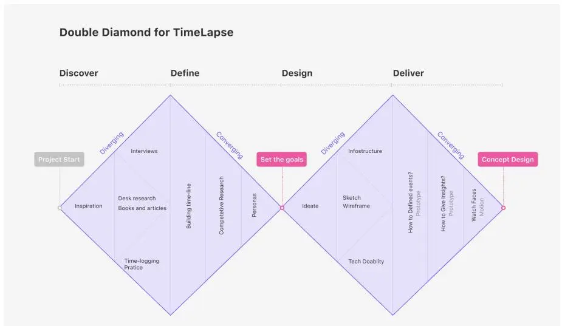

**Double Diamond for TimeLapse**

The diagram illustrates the Double Diamond process for TimeLapse, structured into four main phases: Discover, Define, Design, and Deliver. Each phase is represented by a diamond shape, with activities listed inside. The process is connected by a central timeline with key milestones.

- Discover Phase:**
  - Activities: Inspiration, Desk research Books and articles, Time-logging Practice, Interviews.
  - Label: Diverging (top-left), Converging (top-right).
- Define Phase:**
  - Activities: Building time-line, Competitive Research, Personas.
  - Label: Converging (top-left), Diverging (top-right).
- Design Phase:**
  - Activities: Ideate, Sketch Wireframe, Tech Doability, Infrastructure.
  - Label: Diverging (top-left), Converging (top-right).
- Deliver Phase:**
  - Activities: How to Defined events? Prototypes, How to Give Insights? Prototype, Watch Faces, Motion.
  - Label: Converging (top-left), Diverging (top-right).

Key milestones and transitions are marked along the timeline:

- Project Start** (grey box) at the beginning of the Discover phase.
- Set the goals** (pink box) at the transition between the Define and Design phases.
- Concept Design** (pink box) at the end of the Deliver phase.

A diagram of the Double Diamond process for TimeLapse, showing four phases: Discover, Define, Design, and Deliver. Each phase contains specific activities and is connected by a central timeline.

## Inspiration

I was first fascinated by the features of smartwatches. But all of them just don't add up to formulate a whole purpose and makes smartwatches still alternative devices.

Reconsidering the most used apps on my watch, I realized that exercise, to-do list, sleep monitor is all related to how I spend my time, in other words, my daily routine.

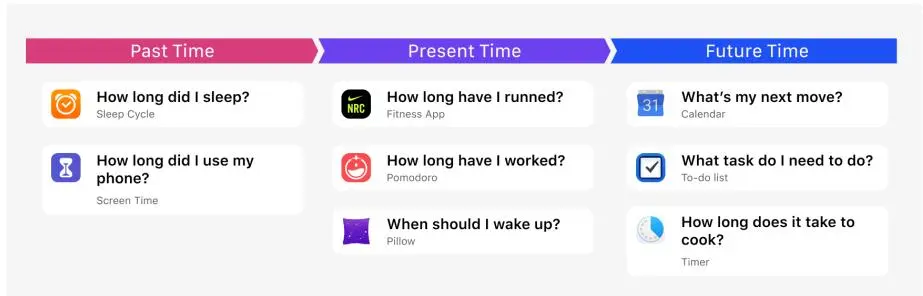

The diagram illustrates a timeline of time, divided into three main sections: Past Time, Present Time, and Future Time. Each section contains a grid of smartwatch app cards, each with an icon, a question, and the app name.

| Past Time                                          | Present Time                                  | Future Time                                     |
|----------------------------------------------------|-----------------------------------------------|-------------------------------------------------|
| <b>How long did I sleep?</b> Sleep Cycle        | <b>How long have I runned?</b> Fitness App | <b>What's my next move?</b> Calendar         |
| <b>How long did I use my phone?</b> Screen Time | <b>How long have I worked?</b> Pomodoro    | <b>What task do I need to do?</b> To-do list |
|                                                    | <b>When should I wake up?</b> Pillow       | <b>How long does it take to cook?</b> Timer  |

A diagram showing a timeline of time from Past Time to Future Time, with various smartwatch apps categorized into these three periods. Sleep Cycle icon Fitness App icon Calendar icon Screen Time icon Pomodoro icon To-do list icon Pillow icon Timer icon

The image shows the front cover and spine of a book. The cover is a light cream color. In the center, there is a painting of a man with a white beard, wearing a dark blue coat and a light-colored hat. He is standing in front of a wall of wooden drawers, similar to a filing cabinet. Each drawer has a small label with a Russian word. The words visible include: ТАКОНОКИЯ, ЗООЛОГИЯ, СИСТЕМАТИКА, ФИЗИОЛОГИЯ, ГЕНЕТИКА, РЕОЛОГИЯ, ФИЛОСОФИЯ, МАТЕМАТИКА, ИСТОРИЯ, А. ЛЮБИЩЕВ, and ИСТОРИЯ. A white banner with black text is draped across the middle of the cover, reading 'Эта странная жизнь'. Another white banner at the top right reads 'Даниил Гранин'. The spine of the book is on the left, with the title 'Эта странная жизнь' written vertically and the author's name 'Даниил Гранин' at the bottom.

Book cover of 'Эта странная жизнь' (This Strange Life) by Даниил Гранин. The cover features a man in a hat and coat standing in front of a wall of wooden drawers labeled with scientific terms in Russian. The title is written on a banner across the middle.

## The Book: Strange Life

The Russian Scientist Alexander Lyubishchev had invented his time-counting system and practised for 56 years with paper and pencil. His biography tells us the benefits and methodology to get a clear perception of time-spending.

“

But are we getting the full potential of a smart device in telling time?

## Research: Timeline experiment

I tried to apply Lyubishchev's method and illustrated daily routines for my friends and me. It was refreshing to sit down with the interviewees and review their timeline.

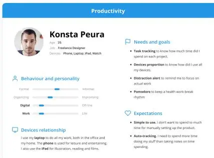

**Productivity**

**Konsta Peura**  
Age 25  
Job: Freelance Designer  
Devices: Phone, Laptop, iPad, Watch

**Needs and goals**

- **Task tracking** to know how much time did I spend on each project.
- **Devices proportion** to know how did I use all my devices.
- **Distraction alert** to remind me to focus on actual work
- **Pomodoro** to keep a health work break rhythm

**Behaviour and personality**

Formal  Informal

Organizing  Improvising

Digital  Off-line

Work  Life

**Devices relationship**

I use my **laptop** to do all my work, both in the office and my home. The **phone** is used for leisure and entertaining. I also use the **iPad** for illustration, reading and films.

**Expectations**

- **Simple to use.** I don't want to spend to much time for manually setting up the product.
- **Auto-tracking.** I need to spend more time doing my stuff than taking notes on time spending.

Portrait of Konsta Peura

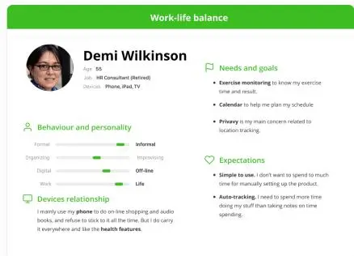

**Work-life balance**

**Demi Wilkinson**  
Age 55  
Job: HR Consultant (Retired)  
Devices: Phone, iPad, TV

**Needs and goals**

- **Exercise monitoring** to know my exercise time and result.
- **Calendar** to help me plan my schedule
- **Privacy** is my main concern related to location tracking.

**Behaviour and personality**

Formal  Informal

Organizing  Improvising

Digital  Off-line

Work  Life

**Devices relationship**

I mainly use my **phone** to do on-line shopping and audio books, and refuse to stick to it all the time. But I do carry it everywhere and like the **health features**.

**Expectations**

- **Simple to use.** I don't want to spend to much time for manually setting up the product.
- **Auto-tracking.** I need to spend more time doing my stuff than taking notes on time spending.

Portrait of Demi Wilkinson

### Timeline Experiment

![Figure 1: A timeline visualization showing the daily activities of four individuals (Me, Sun, Chan, Yu) on specific dates in August 2019. The timeline is divided into 12-hour segments. Activities are represented by colored blocks: purple for 'Leisure', orange for 'Work', green for 'Fitness', red for 'Dinner', blue for 'Sleep', and yellow for 'Personal'. The activities are labeled with their names and the time segment they occupy. For example, 'Me' on August 23, 2019, shows a long 'Leisure' block from 12 AM to 12 PM, followed by 'Sleep' from 12 PM to 1 AM, and then a series of 'Work' and 'Leisure' blocks throughout the day. 'Sun' on August 15, 2019, shows a long 'Leisure' block from 12 AM to 12 PM, followed by 'Sleep' from 12 PM to 1 AM, and then a series of 'Work' and 'Leisure' blocks throughout the day. 'Chan' on August 15, 2019, shows a long 'Leisure' block from 12 AM to 12 PM, followed by 'Sleep' from 12 PM to 1 AM, and then a series of 'Work' and 'Leisure' blocks throughout the day. 'Yu' on August 28, 2019, shows a long 'Leisure' block from 12 AM to 12 PM, followed by 'Sleep' from 12 PM to 1 AM, and then a series of 'Work' and 'Leisure' blocks throughout the day.](imagenes/026.webp)

Figure 1: A timeline visualization showing the daily activities of four individuals (Me, Sun, Chan, Yu) on specific dates in August 2019. The timeline is divided into 12-hour segments. Activities are represented by colored blocks: purple for 'Leisure', orange for 'Work', green for 'Fitness', red for 'Dinner', blue for 'Sleep', and yellow for 'Personal'. The activities are labeled with their names and the time segment they occupy. For example, 'Me' on August 23, 2019, shows a long 'Leisure' block from 12 AM to 12 PM, followed by 'Sleep' from 12 PM to 1 AM, and then a series of 'Work' and 'Leisure' blocks throughout the day. 'Sun' on August 15, 2019, shows a long 'Leisure' block from 12 AM to 12 PM, followed by 'Sleep' from 12 PM to 1 AM, and then a series of 'Work' and 'Leisure' blocks throughout the day. 'Chan' on August 15, 2019, shows a long 'Leisure' block from 12 AM to 12 PM, followed by 'Sleep' from 12 PM to 1 AM, and then a series of 'Work' and 'Leisure' blocks throughout the day. 'Yu' on August 28, 2019, shows a long 'Leisure' block from 12 AM to 12 PM, followed by 'Sleep' from 12 PM to 1 AM, and then a series of 'Work' and 'Leisure' blocks throughout the day.

### Insights

**Timeline unveils user patterns.** Users often overrate working hours and underestimate leisure time. Reviewing the graph exposed undiscoverable patterns like distractions on work.

Digital devices cover most of our time. Even some older user who doesn't use computers could use the location data to recall events accurately.

Manually time-tracking is painful. The user would quickly feel frustrated once they forget to log.

Natural language is better than timestamps. Some software provided complex, unorganized data. But we prefer to describe an event in a semantics sentence.

## Create Friendly Timeline with Multitile Devices

I first conducted a competitive audit to lay out all kinds of data available in other time-tracking apps.

|                  |  |  |  |  |  |
|------------------|-----------------------------------------------------------------------------------------------------------------------------------|-----------------------------------------------------------------------------------------------------------------------------------------------------|------------------------------------------------------------------------------------------------------------------------------------------------|------------------------------------------------------------------------------------------------------------------------------------------------------|-------------------------------------------------------------------------------------------------------------------------------------------------------|
| UX/UI            | Superday                                                                                                                          | Timing                                                                                                                                              | aTimeLogger                                                                                                                                    | iOS Screen Time                                                                                                                                      | Life Cycle                                                                                                                                            |
| Visual Design    | Great                                                                                                                             | Regular                                                                                                                                             | Poor                                                                                                                                           | Good                                                                                                                                                 | Poor                                                                                                                                                  |
| Usability        | Great                                                                                                                             | Great                                                                                                                                               | Great                                                                                                                                          | Regular                                                                                                                                              | Great                                                                                                                                                 |
| Complexity       | Simple                                                                                                                            | Complex                                                                                                                                             | Simple                                                                                                                                         | Regular                                                                                                                                              | Simple                                                                                                                                                |
| Tracking         | Manual + Auto                                                                                                                     | Manual + Auto                                                                                                                                       | Manual                                                                                                                                         | Auto                                                                                                                                                 | Manual + Auto                                                                                                                                         |
| Timeline         | ✓                                                                                                                                 | ✓                                                                                                                                                   | ✓                                                                                                                                              | --                                                                                                                                                   | --                                                                                                                                                    |
| Review           | Chart                                                                                                                             | Chart + Score                                                                                                                                       | Chart                                                                                                                                          | Brief + Chart                                                                                                                                        | Chart                                                                                                                                                 |
| Data Usage       |                                                                                                                                   |                                                                                                                                                     |                                                                                                                                                |                                                                                                                                                      |                                                                                                                                                       |
| Devices          |                    |                                     |                                |                                      |                                        |
| App Usage        | --                                                                                                                                | ✓                                                                                                                                                   | --                                                                                                                                             | ✓                                                                                                                                                    | --                                                                                                                                                    |
| Location         | ✓                                                                                                                                 | ✓                                                                                                                                                   | --                                                                                                                                             | --                                                                                                                                                   | ✓                                                                                                                                                     |
| Wi-Fi            | --                                                                                                                                | --                                                                                                                                                  | --                                                                                                                                             | --                                                                                                                                                   | ✓                                                                                                                                                     |
| Health & Fitness | --                                                                                                                                | --                                                                                                                                                  | --                                                                                                                                             | ✓                                                                                                                                                    | --                                                                                                                                                    |

## Prototype: Events, Behaviours and Activities

Previous research shows how people described their time-spending. I came up with the idea of defining a behaviour with a start, process and end with different activities. There are three layers in this system: Events, Behaviours, and Activities.

### Events

### Behaviours

### Activities

![A screenshot of a productivity app interface showing a timeline of tasks. The left sidebar has three main categories: 'Transport' (35min), 'Work' (3h 23min), and 'Lunch' (40min). The 'Work' category is expanded, showing a list of tasks: 'Walk' (5min), 'Design' (1h 24min, On MacBook), 'Walk' (5min), 'Browsing' (10min, On iPhone), 'Office' (4h 20min, 1:48 PM - 6:42 PM), 'Project 1' (2h 32min, 1:48 PM - 2:42 PM), 'Browsing Projects' (1h 2min, 1:48 PM - 2:42 PM), and 'Assets Management' (32min, 1:48 PM - 2:42 PM). Each task is represented by a colored bar with an icon and a duration. The 'Design' task is highlighted in orange, and the 'Browsing' task is highlighted in blue. The 'Office' task is highlighted in light blue. The 'Project 1' task is highlighted in light blue. The 'Browsing Projects' task is highlighted in light blue. The 'Assets Management' task is highlighted in light blue.](imagenes/028.webp)

The screenshot displays a productivity application interface. On the left, a vertical sidebar contains three main sections: 'Transport' (35min), 'Work' (3h 23min), and 'Lunch' (40min). The 'Work' section is expanded, revealing a list of tasks. Each task is represented by a colored bar with an icon, a title, a subtitle, and a duration. The tasks are: 'Walk' (5min), 'Design' (1h 24min, On MacBook), 'Walk' (5min), 'Browsing' (10min, On iPhone), 'Office' (4h 20min, 1:48 PM - 6:42 PM), 'Project 1' (2h 32min, 1:48 PM - 2:42 PM), 'Browsing Projects' (1h 2min, 1:48 PM - 2:42 PM), and 'Assets Management' (32min, 1:48 PM - 2:42 PM). The 'Design' task is highlighted in orange, and the 'Browsing' task is highlighted in blue. The 'Office' task is highlighted in light blue. The 'Project 1' task is highlighted in light blue. The 'Browsing Projects' task is highlighted in light blue. The 'Assets Management' task is highlighted in light blue.

A screenshot of a productivity app interface showing a timeline of tasks. The left sidebar has three main categories: 'Transport' (35min), 'Work' (3h 23min), and 'Lunch' (40min). The 'Work' category is expanded, showing a list of tasks: 'Walk' (5min), 'Design' (1h 24min, On MacBook), 'Walk' (5min), 'Browsing' (10min, On iPhone), 'Office' (4h 20min, 1:48 PM - 6:42 PM), 'Project 1' (2h 32min, 1:48 PM - 2:42 PM), 'Browsing Projects' (1h 2min, 1:48 PM - 2:42 PM), and 'Assets Management' (32min, 1:48 PM - 2:42 PM). Each task is represented by a colored bar with an icon and a duration. The 'Design' task is highlighted in orange, and the 'Browsing' task is highlighted in blue. The 'Office' task is highlighted in light blue. The 'Project 1' task is highlighted in light blue. The 'Browsing Projects' task is highlighted in light blue. The 'Assets Management' task is highlighted in light blue.

![A collection of hand-drawn sketches for a mobile application interface, organized into three rows. The top row shows 'Insights' (a star icon), 'Insights Detail' (a line graph), 'Work Even' (a calendar view), and a settings menu. The middle row shows 'Timeline' (a vertical list of events), 'Work' (a task list), and another settings menu. The bottom row shows various clock and productivity widgets: 'Dec 9 Line', 'Bubble', 'Productivity', 'Feed', 'Clock Wheel', 'Pomodoro Graph', 'Minute Clock', 'Calony', and 'Koto desage'.](imagenes/004.webp)

The sketches are organized into three rows, each representing a different section of the mobile application interface.

**Top Row:**

- Insights:** A circular icon with a star, representing a summary or overview.
- Insights Detail:** A screen showing a line graph, a bar chart, and a list of items, with a 'Settings' button.
- Work Even:** A screen showing a calendar view with a 'Work' button and a 'Tap' button.
- Settings:** A screen showing a list of settings options.

**Middle Row:**

- Timeline:** A screen showing a vertical list of events, with a 'Timeline' button and a 'Tap' button.
- Work:** A screen showing a list of tasks, with a 'Work' button and a 'Tap' button.
- Settings:** A screen showing a list of settings options.

**Bottom Row:**

- Dec 9 Line:** A clock face with a line graph overlay, labeled 'Dec 9 Line'.
- Bubble:** A clock face with bubbles, labeled 'Bubble'.
- Productivity:** A clock face with a productivity graph, labeled 'Productivity'.
- Feed:** A clock face with a feed, labeled 'Feed'.
- Clock Wheel:** A clock face with a wheel, labeled 'Clock Wheel'.
- Pomodoro Graph:** A clock face with a Pomodoro graph, labeled 'Pomodoro Graph'.
- Minute Clock:** A clock face with a minute clock, labeled 'Minute Clock'.
- Calony:** A clock face with a calony, labeled 'Calony'.
- Koto desage:** A clock face with a koto desage, labeled 'Koto desage'.

A collection of hand-drawn sketches for a mobile application interface, organized into three rows. The top row shows 'Insights' (a star icon), 'Insights Detail' (a line graph), 'Work Even' (a calendar view), and a settings menu. The middle row shows 'Timeline' (a vertical list of events), 'Work' (a task list), and another settings menu. The bottom row shows various clock and productivity widgets: 'Dec 9 Line', 'Bubble', 'Productivity', 'Feed', 'Clock Wheel', 'Pomodoro Graph', 'Minute Clock', 'Calony', and 'Koto desage'.

## Providing Insights

Quantified-self is not completed without valuable review and feedback. I designed “highlights” to automatically present information on productivity, sleep, fitness, distractions, and memorable moments.

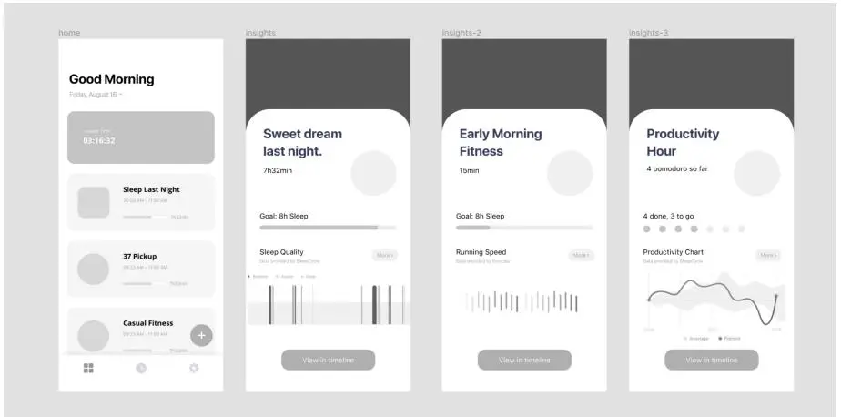

The figure displays four mobile app screens, each representing a different category of user data: Home, Insights, Insights-2, and Insights-3.

- home:** This screen features a "Good Morning" greeting for Friday, August 16. It includes four main sections: "Sweet dream last night" (03:16:32), "Sleep Last Night" (09:00 AM - 11:00 AM, 7h32min), "37 Pickup" (09:23 AM - 11:00 AM, 7h32min), and "Casual Fitness" (09:00 AM - 11:00 AM, 7h32min). Each section has a progress bar and a "View in timeline" button.
- insights:** This screen shows a "Sweet dream last night" section with a 7h32min duration. It includes a "Goal: 8h Sleep" progress bar and a "Sleep Quality" chart showing sleep stages (Awake, Asleep, Deep). A "View in timeline" button is at the bottom.
- insights-2:** This screen displays an "Early Morning Fitness" section with a 15min duration. It includes a "Goal: 8h Sleep" progress bar and a "Running Speed" chart showing speed over time. A "View in timeline" button is at the bottom.
- insights-3:** This screen shows a "Productivity Hour" section with a 4 pomodoro so far duration. It includes a "4 done, 3 to go" progress bar and a "Productivity Chart" showing productivity over time. A "View in timeline" button is at the bottom.

Four mobile app screens showing health and productivity insights.

## Home and Settings

The home screen shows all the reviews and the current event. The users could adjust events in settings. The app would also turn to the dark mode in the sleeping event.

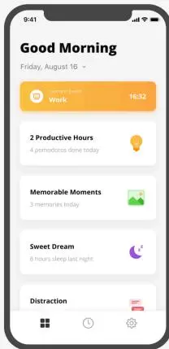

The image shows the 'Home' screen of a mobile application in light mode. At the top, the status bar shows the time as 9:41. The main header reads 'Good Morning' in bold, followed by the date 'Friday, August 16'. Below this is a large orange button labeled 'Current Event Work' with a clock icon and the time '16:32'. The screen features three main content cards: '2 Productive Hours' with a lightbulb icon and '4 pomodoros done today'; 'Memorable Moments' with a green landscape icon and '3 memories today'; and 'Sweet Dream' with a purple moon icon and '8 hours sleep last night'. At the bottom, there is a 'Distraction' card with a red notification icon. The bottom navigation bar contains four icons: a grid, a clock, a gear, and a red notification icon.

Home screen of the app in light mode.

Home

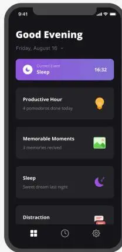

The image shows the 'Home' screen of a mobile application in dark mode. The layout is identical to the light mode version, but the color scheme is inverted. The header reads 'Good Evening'. The main button is purple and labeled 'Current Event Sleep' with the time '16:32'. The content cards are: 'Productive Hour' with a lightbulb icon and '4 pomodoros done today'; 'Memorable Moments' with a green landscape icon and '3 memories received'; and 'Sleep' with a purple moon icon and 'Sweet dream last night'. The 'Distraction' card at the bottom also has a red notification icon. The bottom navigation bar icons are the same as in the light mode version.

Home screen of the app in dark mode.

Home (dark)

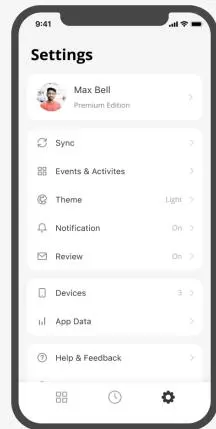

The image shows the 'Settings' screen of the mobile application. At the top, the status bar shows the time as 9:41. The header reads 'Settings' in bold. Below this is a user profile section for 'Max Bell' with a 'Premium Edition' label and a right-pointing arrow. The settings list includes: 'Sync' with a refresh icon and a right-pointing arrow; 'Events & Activities' with a calendar icon and a right-pointing arrow; 'Theme' with a gear icon, the label 'Light', and a right-pointing arrow; 'Notification' with a bell icon, the label 'On', and a right-pointing arrow; 'Review' with an envelope icon, the label 'On', and a right-pointing arrow; 'Devices' with a smartphone icon, the label '3', and a right-pointing arrow; 'App Data' with a bar chart icon and a right-pointing arrow; and 'Help & Feedback' with a speech bubble icon and a right-pointing arrow. The bottom navigation bar contains four icons: a grid, a clock, a gear, and a red notification icon.

Settings screen of the app.

Settings

### Productivity and Health

They get data from apps of Pomodoro, calendar, exercise and health monitor. It is designed to use simple words and sentences to describe the key insights and provide charts on the detailed view. The users could set goals and track their status.

### **Memorable Moments**

It captures groups of photos or videos taken in a day and chronologically displays them or create a visual routine of your highlights. This revives the mental model of how people recall their events in the interview.

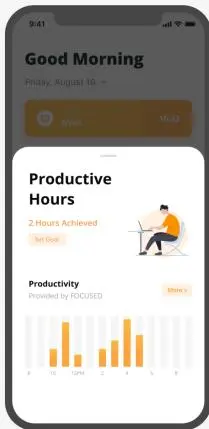

9:41 Friday, August 16 16:32

**Good Morning**

Work

**Productive Hours**

2 Hours Achieved

Set Goal

**Productivity**  
Provided by FOCUSED

More >

Bar chart showing productivity levels over 8 hours. The x-axis is labeled 0, 1, 2, 3, 4, 5, 6, 7, 8. The y-axis represents productivity levels. The chart shows a peak in productivity around hour 3.

Productivity dashboard on a smartphone screen.

Productivity

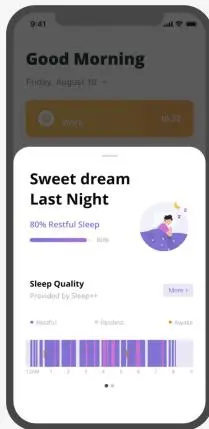

9:41 Friday, August 16 16:32

**Good Morning**

Work

**Sweet dream Last Night**

80% Restful Sleep

80%

**Sleep Quality**  
Provided by Sleep++

More >

Legend: Restful (blue), Restless (orange), Awake (green)

Timeline chart showing sleep quality over 8 hours. The x-axis is labeled 0, 1, 2, 3, 4, 5, 6, 7, 8. The y-axis represents sleep quality. The chart shows a high percentage of restful sleep (blue) throughout the night.

Sleep dashboard on a smartphone screen.

Sleep

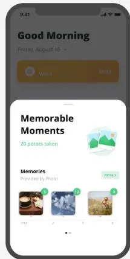

9:41 Friday, August 16 16:32

**Good Morning**

Work

**Memorable Moments**

20 photos taken

**Memories**  
Provided by Photo

More >

Timeline of memorable moments. The x-axis is labeled 0, 1, 2, 3, 4. The y-axis represents the number of photos taken. The chart shows a peak in photos taken around hour 2.

Memorable Moments dashboard on a smartphone screen.

Moments

### Timeline

This is a direct and straightforward approach to all the activities. Power users could also tap for more details in each section. It also shows people how the data from other apps were used.

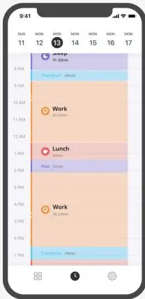

The Timeline view shows a day starting on Monday, September 13th, from 8 AM to 7 PM. The events are as follows:

| Time  | Event     | Duration |
|-------|-----------|----------|
| 8 AM  | Transport | 30min    |
| 9 AM  | Transport | 30min    |
| 10 AM | Work      | 4h 20min |
| 12 AM | Lunch     | 30min    |
| 1 PM  | Nap       | 30min    |
| 3 PM  | Work      | 4h 30min |
| 6 PM  | Transport | 30min    |

Timeline view of a day with various events.

Timeline

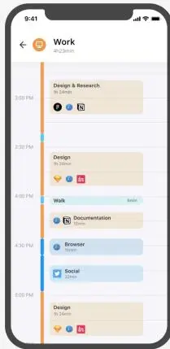

The Work Event view shows a detailed list of tasks for the 'Work' event on Monday, September 13th, from 3:00 PM to 5:00 PM. The tasks are as follows:

| Time    | Task              | Duration |
|---------|-------------------|----------|
| 3:00 PM | Design & Research | 3h 20min |
| 3:30 PM | Design            | 3h 20min |
| 4:00 PM | Walk              | 30min    |
| 4:30 PM | Documentation     | 30min    |
| 4:50 PM | Browser           | 30min    |
| 5:00 PM | Social            | 20min    |

Work Event view showing detailed tasks.

Work Event

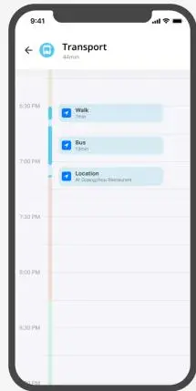

The Transport Event view shows a detailed list of transport events for the 'Transport' event on Monday, September 13th, from 6:00 PM to 8:00 PM. The events are as follows:

| Time    | Event    | Duration                |
|---------|----------|-------------------------|
| 6:00 PM | Walk     | 30min                   |
| 6:30 PM | Bus      | 30min                   |
| 7:00 PM | Location | At Guangzhou Restaurant |

Transport Event view showing location and duration.

Transport Event

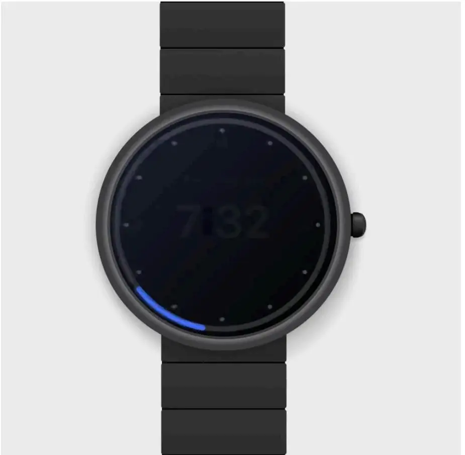

A black smartwatch with a black strap, displayed against a light gray background. The watch face is dark and shows the time 7:32 in a large, light-colored font. There are small white dots around the perimeter of the watch face, likely representing hour markers. A blue arc is visible on the left side of the watch face, possibly indicating a battery level or a task completion status. The watch has a small button on the right side of the case.

A black smartwatch with a black strap, displaying the time 7:32 on a dark screen. A blue arc is visible on the left side of the watch face.

### Back to the watch

As for “how we read the time on a smartwatch”, I designed the watch face that shows current time and task. Timeline is also available to see previous events of the day.

## My Takeaways

**1. Design for online-offline balance.** This project enables me to take a deep dive into how people interact with their devices. Meanwhile, the tech giants are announcing “screen time monitor” everywhere. I took my first exploration and practice on the design for unplugging.

**2. A review is just as significant as planning.** While we all take notes on tasks in advanced, we often forget about reflection. An inspection improves us and gives insights.

Hand made with  by sylvester lau. All rights reserved ©2022